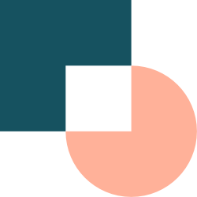

### Hey there, I'm Tommy! 👋 
##### He / him 🇵🇱  Polish

* Senior Web Developer at <a href="https://www.codility.com/">Codility</a>
* Current Stack: PHP & Wordpress & JS & TS
* Automation, Hyperautomation & AI
* 🎧 DJ at weekends (Deep House, Melodic House, Jackin' House)

### Little intro
-----------------

I specialize in working with startups in their seed stage, and also small to mid-size companies I pride myself on communicating directly and collaborating with key decision-makers throughout the development process.

I am constantly seeking new challenges and opportunities to further my knowledge and skills in the field, currently looking for a team to join as a co-founder/CTO to a cool SaaS project.

#### Fundamental Stack

  

    
    
    
    
    
    
    
    
    
  

-------------

#### Libraries and Frameworks with commercial experience

  

    
    
    
    
    
    
  

  
------------------------------------------
  
#### Other tools i'm working with on daily basis

  

    
    
    
    
    
    
    
    
    
    
    
    
    
    
    
  

------------------------------------------

#### Specialities

 Wide experience with Woocommerce and Wordpress development. Vetted successfully by <a href="https://www.codeable.io/">Codeable</a>  
💡 Ideas creator, good problem solver.  
🚊 Automation  
🎨 Artistic sense, detail-oriented, high EQ. 

#### Happy to connect!

  
  
  

#### A bit of stats

  
###### Currently exploring 

